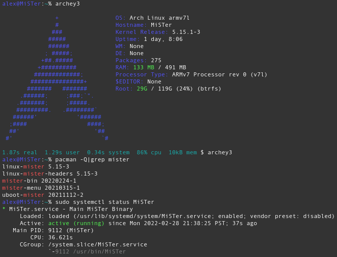

# MiSTer + Arch Linux ARM

I found out about [MiSTer](https://github.com/MiSTer-devel/Main_MiSTer/wiki)
via [LGR's MiSTer Multisystem video](https://www.youtube.com/watch?v=qx45r-BRHxY),
since then I've been enjoying it very much.

One thing I've had difficulties with was the original OS. Despite it being
designed to be an appliance, it seems very brittle to store an OS's worth of
data (and precious saved games / hard drive images) on a exfat SD card.
Also, any modifications you make to the OS might be lost come update time.

I want to be able to run Arch on my MiSTer! If you want to do the same
this project is for you.

[**Installation Instructions**](INSTALL.md)

## Community

Chat with other MiSTerArch users on:

* Matrix: [#MiSTerArch:hypertriangle.com](https://matrix.to/#/#MiSTerArch:hypertriangle.com)
* IRC: irc://irc.libera.chat/MiSTerArch ([webchat](https://web.libera.chat/#MiSTerArch))

## Packages

This repository contains the [PKGBUILDs](https://wiki.archlinux.org/title/PKGBUILD)
for the arch linux arm packages required to run the MiSTer hardware. Including
MiSTer's official uboot, kernel, binaries and support files (ex: .rbf files for
cores). Ideally all updates will now be done through arch package managers,
and there should be no need to run MiSTer's update scripts.

### Binaries

Complete builds of these packages can be found in the [binaries](https://github.com/MiSTerArch/binaries)
repo of this org. It's also served with gh-pages, which means it
can be directly added as a repo in `/etc/pacman.conf` so your MiSTer knows
where to get MiSTerArch packages automatically at update time. See
[installation instructions](INSTALL.md#repository-setup) for how.

### AUR
Some binary packages that are easy to "build" on a MiSTer (ex:
[mister-bin](https://aur.archlinux.org/packages/mister-bin),
[mister-menu](https://aur.archlinux.org/packages/mister-menu))
are also **mirrored on the AUR**, in order to delegate the frequent
repackaging to the each MiSTer device (similar to what the older
update scripts used to do, but easier to manage). This might become handy
once we get a couple [PKGBUILDs that can automatically version themselves](https://wiki.archlinux.org/title/VCS_package_guidelines#The_pkgver()_function).

### Guidelines
We follow the [-bin](https://wiki.archlinux.org/title/AUR_submission_guidelines#Rules_of_submission) and [-git](https://wiki.archlinux.org/title/VCS_package_guidelines#Guidelines) naming conventions of the rest of the Arch
community. The only added exception: -bin suffix is not required for bitstreams
(pretty much all of the cores), as running quartus to compile a new binary on
an armv7 MiSTer CPU would be laughable.

## /media/fat

The main MiSTer binary and quite a few MiSTer scripts are hardcoded to
use `/media/fat` as a case-insensitive location for doing everything.

For now this path's contents is under the user's control. One can even mount
an old style exfat partition using `/etc/fstab`. For now `mister-bin`'s
[post-install hook](https://github.com/MiSTerArch/PKGBUILDs/blob/main/mister-bin/mister-bin.install)
has a suggestion on how to populate things in Mister by cloning
[Distribution_MiSTer](https://github.com/MiSTer-devel/Distribution_MiSTer).

There's a couple of other techniques that might be of interest here:

* [ciopfs](https://aur.archlinux.org/packages/ciopfs) - store files elsewhere
  and mount them in a case-insensitive fashion to `/media/fat`
* [mergerfs](https://aur.archlinux.org/packages/mergerfs) - combine with
  sshfs / cifs mounts to achieve a merged filesystem, where some of paths
  in `/media/fat/` are not directly on the sd card, but others are
* bind mounts

In the future it's possible we'll package up such content somewhere like
`/usr/share/mister`, and use various mounts so MiSTer can see a view of
it in `/media/fat`. Bonus: If packaged this way such packages could be
installed on x86 Arch machines that could act like a sshfs or samba server
for various MiSTers on a LAN.

## What now?

Now that the MiSTer runs Arch, what more could it do?

* [sshfs](https://wiki.archlinux.org/title/SSHFS) mounting of remote filesystem,
  even with [systemd automounting](https://wiki.archlinux.org/title/SSHFS#Automounting)
* [btrfs](https://wiki.archlinux.org/title/Btrfs) and
  [btrbk remote snapshot](https://github.com/digint/btrbk) possiblities
* [USB/IP](https://wiki.archlinux.org/title/USB/IP) in case you don't have a
  carrier board yet and forgot to buy an usb otg cable, just ssh in and
  forward your usb device from another computer. This happened to me.
* Repurpose the hardware for other FPGA shenanigans, maybe you want to develop
  your own FPGA stuff but still want to run arch on the resulting system,
  [zangman style](https://github.com/zangman/de10-nano/wiki).
    * Maybe you want to write linux drivers for
    [LiteX IP](https://github.com/enjoy-digital/litex) blocks.
